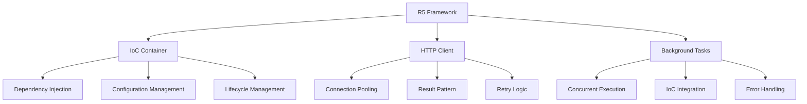
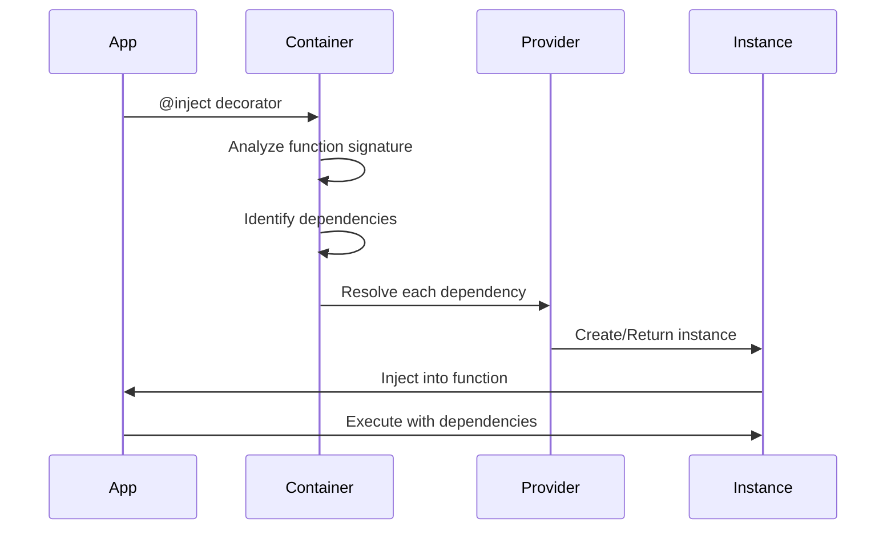

# Conceptos Fundamentales

Entiende los conceptos clave que hacen funcionar R5.

## Arquitectura del Framework

R5 está construido sobre tres pilares fundamentales:



## 1. IoC Container (Inversion of Control)

### ¿Qué es IoC?

Inversión de Control (IoC) es un patrón donde el framework controla el flujo de la aplicación y la creación de objetos, en lugar de que tu código lo haga manualmente.

### Componentes del IoC

#### Container

El contenedor central que registra y resuelve dependencias:

```python
from R5.ioc import Container

container = Container.get_container()
provider = Container.get_provider(MyService)
instance = Container.resolve(MyService)
```

#### Scopes (Alcances)

R5 soporta tres scopes:

**Singleton** - Una única instancia compartida:

```python
from R5.ioc import singleton

@singleton
class DatabaseConnection:
    def __init__(self):
        self.conn = connect_to_db()
```

**Factory** - Nueva instancia en cada resolución:

```python
from R5.ioc import factory

@factory
class Request:
    def __init__(self):
        self.id = generate_uuid()
```

**Resource** - Instancia con lifecycle (context manager):

```python
from R5.ioc import resource

@resource
class FileHandler:
    async def __aenter__(self):
        self.file = open("data.txt")
        return self
    
    async def __aexit__(self, *args):
        self.file.close()
```

#### Dependency Injection

Inyección automática basada en type hints:

```python
from R5.ioc import inject, singleton

@singleton
class EmailService:
    def send(self, to: str, message: str):
        print(f"Sending to {to}: {message}")

@singleton
class UserService:
    def __init__(self, email: EmailService):
        self._email = email
    
    def notify_user(self, user_email: str):
        self._email.send(user_email, "Welcome!")

@inject
def process(user_svc: UserService):
    user_svc.notify_user("user@example.com")

process()
```

### Configuration Management

Carga configuración desde múltiples formatos:

```python
from R5.ioc import config

@config(file='config.json')
class AppConfig:
    database_url: str = "sqlite:///db.sqlite"
    api_key: str = ""
    debug: bool = False
    workers: int = 4
```

Formatos soportados:

- `.env` - Variables de entorno
- `.json` - JSON
- `.yml`/`.yaml` - YAML
- `.properties` - Java properties

## 2. HTTP Client

### Connection Pooling

R5 usa `httpx.AsyncClient` con pooling automático:

```python
from R5.http import Http
from R5.ioc import inject

@inject
async def fetch_data(http: Http):
    # Reutiliza conexiones del pool
    result1 = await http.get("/users/1")
    result2 = await http.get("/users/2")
    result3 = await http.get("/users/3")
```

### Result Pattern

Manejo de errores sin excepciones:

```python
result = await http.get("/users/999")

if result.status == 404:
    print("Usuario no encontrado")
elif result.status == 200:
    user = result.to(UserDTO)
    print(f"Usuario: {user.name}")

result.on_status(404, lambda req, res: handle_not_found())
result.on_exception(lambda e: log_error(e))
```

### Configuración

Configura timeouts, retry, proxies:

```python
from R5.http.http import HttpConfig
from R5.ioc import config

@config
class MyHttpConfig(HttpConfig):
    max_connections: int = 100
    connect_timeout: float = 5.0
    max_retries: int = 3
    retry_backoff_factor: float = 0.5
```

## 3. Background Tasks

### Ejecución Concurrente

Ejecuta tareas en paralelo con anyio:

```python
from R5.background import Background
from R5.ioc import inject

@inject
async def process_batch(bg: Background):
    for i in range(100):
        await bg.add(process_item, i)
    
    await asyncio.sleep(1)
```

### Integración con IoC

Las tareas pueden recibir dependencias inyectadas:

```python
@singleton
class Logger:
    def log(self, msg: str):
        print(f"[LOG] {msg}")

def background_task(logger: Logger, item_id: int):
    logger.log(f"Processing item {item_id}")

@inject
async def main(bg: Background):
    await bg.add(background_task, item_id=42)
```

### Lifecycle Management

Background usa context manager para cleanup automático:

```python
@inject
async def with_cleanup(bg: Background):
    await bg.add(task1)
    await bg.add(task2)
    
    await asyncio.sleep(0.5)

# Al salir, Background espera a que terminen las tareas
```

## Flujo de Ejecución



## Type Safety

R5 aprovecha el sistema de tipos de Python:

```python
from typing import Optional

@singleton
class CacheService:
    pass

@inject
def handler(
    cache: CacheService,              # Required
    optional_cache: Optional[CacheService]  # Optional
):
    if optional_cache:
        print("Cache available")
```

## Principios de Diseño

### 1. Simplicidad

```python
@singleton
class MyService:
    pass

@inject
def use_service(svc: MyService):
    pass
```

Sin configuración XML, sin archivos complejos. Solo decoradores.

### 2. Type-Safe

El container usa type hints para resolución:

```python
@inject
def handler(
    service_a: ServiceA,  # Tipo correcto
    service_b: ServiceB   # Tipo correcto
):
    pass
```

### 3. Modularidad

Usa solo lo que necesitas:

```python
# Solo IoC
from R5.ioc import singleton, inject

# Solo HTTP
from R5.http import Http

# Solo Background
from R5.background import Background
```

### 4. Explicit over Implicit

```python
@inject
async def explicit_deps(
    http: Http,
    bg: Background,
    config: AppConfig
):
    pass
```

Las dependencias son explícitas en la firma de la función.

## Patrones Comunes

### Service Layer

```python
@singleton
class UserRepository:
    async def find(self, user_id: int):
        pass

@singleton
class UserService:
    def __init__(self, repo: UserRepository):
        self._repo = repo
    
    async def get_user(self, user_id: int):
        return await self._repo.find(user_id)
```

### Factory Pattern

```python
@factory
class RequestContext:
    def __init__(self):
        self.request_id = uuid4()
        self.timestamp = datetime.now()
```

### Resource Pattern

```python
@resource
class DatabaseSession:
    async def __aenter__(self):
        self.session = create_session()
        return self
    
    async def __aexit__(self, *args):
        await self.session.close()
```

## Próximos Pasos

- Profundiza en [IoC Container](../guides/ioc/overview.md)
- Aprende sobre [HTTP Client](../guides/http/overview.md)
- Explora [Background Tasks](../guides/background/overview.md)
- Revisa [Ejemplos prácticos](../examples/simple.md)
