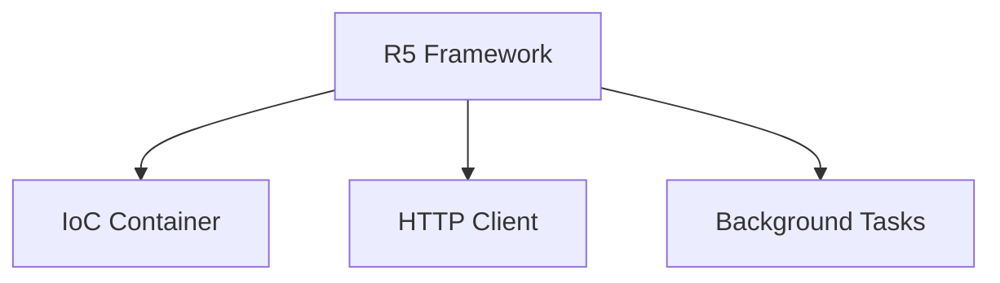

# Conceptos Fundamentales

R5 está construido sobre tres pilares:



## IoC Container

Gestión automática de dependencias basada en type hints. Registras servicios con decoradores y se inyectan automáticamente.

```python
from R5.ioc import singleton, inject

@singleton
class UserService:
    def __init__(self, db: DatabaseService):
        self.db = db

@inject
async def handler(service: UserService, user_id: int):
    return service.find(user_id)

await handler(user_id=123)  # UserService y DatabaseService se inyectan
```

**Scopes**: `@singleton` (una instancia), `@factory` (nueva cada vez), `@resource` (con lifecycle/cleanup)

**Configuración**: `@config(file='.env')` carga desde .env, .json, .yml, .properties

Ver [Guía IoC](../guides/ioc/overview.md) para detalles.

## HTTP Client

Cliente asíncrono con connection pooling, retry y Result pattern (sin excepciones):

```python
from R5.http import Http
from R5.ioc import inject

@inject
async def fetch(http: Http):
    result = await http.retry(attempts=3).get("https://api.example.com/users/1")

    user = result.to(User)           # Mapeo automático a DTO
    result.on_status(404, handle_404) # Handler por status
    result.on_exception(log_error)    # Handler de errores
```

Ver [Guía HTTP](../guides/http/overview.md) para detalles.

## Background Tasks

Ejecución concurrente de tareas con anyio. Soporta sync (thread pool) y async (event loop), con inyección IoC en las tareas:

```python
from R5.background import Background

def task(logger: Logger, item_id: int):
    logger.log(f"Processing {item_id}")  # Logger inyectado

@inject
async def main(bg: Background):
    for i in range(10):
        await bg.add(task, item_id=i)
    await asyncio.sleep(1)
```

Ver [Guía Background](../guides/background/overview.md) para detalles.

## Principios de Diseño

- **Simplicidad** - Solo decoradores, sin configuración XML
- **Type-safe** - Resolución automática via type hints
- **Modularidad** - Usa solo lo que necesitas: `from R5.ioc import ...`, `from R5.http import ...`
- **Explícito** - Las dependencias son visibles en la firma de la función

## Próximos Pasos

- [IoC Container](../guides/ioc/overview.md) - Inyección de dependencias
- [HTTP Client](../guides/http/overview.md) - Cliente HTTP
- [Background Tasks](../guides/background/overview.md) - Tareas concurrentes
