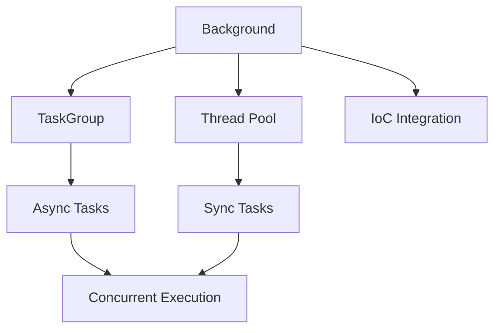

# Background Tasks - Overview

Ejecuta tareas en paralelo con anyio, soporte para sync/async y inyección IoC.

## Características

- **Ejecución concurrente** con anyio TaskGroup
- **Sync y Async** - Sync ejecuta en thread pool, async en event loop
- **Inyección IoC** - Las tareas reciben dependencias automáticamente
- **Error handling** - Errores no detienen otras tareas
- **Lifecycle management** - Context manager integrado

## Arquitectura



## Ejemplo Rápido

```python
from R5.background import Background
from R5.ioc import singleton, inject

@singleton
class Logger:
    def log(self, msg: str): print(msg)

def process(logger: Logger, item_id: int):
    logger.log(f"Processing {item_id}")  # Logger inyectado automáticamente

@inject
async def main(bg: Background):
    await bg.add(process, item_id=1)
    await bg.add(process, item_id=2)
    await asyncio.sleep(1)
```

## Limitaciones

- **No retorna valores** - Usa callbacks o side effects
- **No garantiza orden** - Las tareas se ejecutan concurrentemente

## Próximos Pasos

- [Basic Usage](basic-usage.md) - Tareas sync, async, errores, patrones
- [IoC Integration](ioc-integration.md) - Inyección de dependencias en tareas
