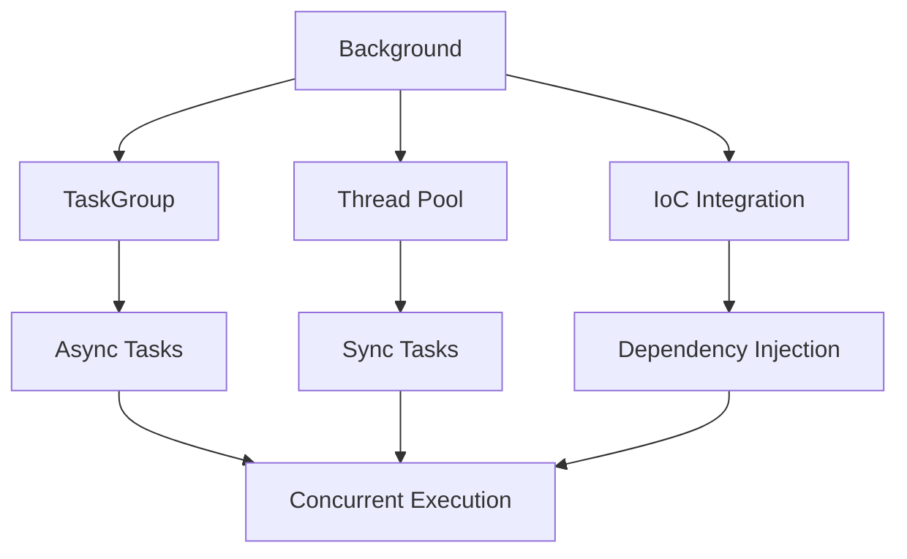
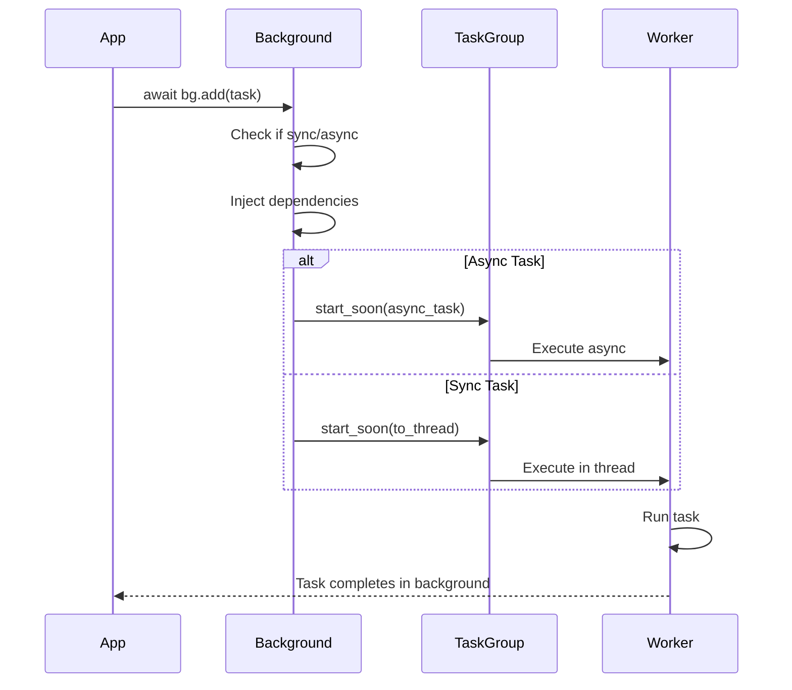

# Background Tasks - Overview

El módulo Background de R5 permite ejecutar tareas en paralelo de forma simple y eficiente usando anyio.

## Características

- ✅ **Ejecución Concurrente** - Tareas en paralelo con anyio
- ✅ **Inyección IoC** - Tareas pueden recibir dependencias
- ✅ **Sync y Async** - Soporta ambos tipos de funciones
- ✅ **Thread Pool** - Tareas sync ejecutan en thread pool
- ✅ **Error Handling** - Errores no detienen otras tareas
- ✅ **Lifecycle Management** - Cleanup automático
- ✅ **Resource Pattern** - Context manager integrado

## Arquitectura



## Componentes

### Background

Clase principal que gestiona tareas:

```python
from R5.background import Background
from R5.ioc import inject

@inject
async def my_service(bg: Background):
    await bg.add(task1)
    await bg.add(task2)
    await asyncio.sleep(1)  # Esperar tareas
```

### TaskGroup

anyio TaskGroup para ejecución concurrente (interno):

```python
# Manejado automáticamente por Background
task_group = create_task_group()
task_group.start_soon(task)
```

### Thread Pool

Pool de threads para tareas síncronas:

```python
# Configuración del pool
@resource
class Background:
    def __init__(self, max_workers: int = 40):
        self._max_workers = max_workers
```

## Flujo de Ejecución



## Uso Básico

### Tarea Simple

```python
import asyncio
from R5.background import Background
from R5.ioc import inject

def process_data(data: str):
    print(f"Processing: {data}")

@inject
async def main(bg: Background):
    await bg.add(process_data, "item1")
    await bg.add(process_data, "item2")
    
    await asyncio.sleep(0.5)
    print("All tasks queued")

if __name__ == "__main__":
    asyncio.run(main())
```

### Tarea Async

```python
async def async_task(item_id: int):
    await asyncio.sleep(0.1)
    print(f"Processed item {item_id}")

@inject
async def main(bg: Background):
    await bg.add(async_task, 1)
    await bg.add(async_task, 2)
    
    await asyncio.sleep(0.5)
```

### Múltiples Tareas

```python
@inject
async def queue_many_tasks(bg: Background):
    for i in range(100):
        await bg.add(process_item, i)
    
    await asyncio.sleep(2)
    print("All 100 tasks completed")
```

## Inyección IoC en Tareas

Las tareas pueden recibir dependencias inyectadas:

```python
@singleton
class Logger:
    def log(self, msg: str):
        print(f"[LOG] {msg}")

def background_task(logger: Logger, item_id: int):
    logger.log(f"Processing item {item_id}")

@inject
async def main(bg: Background):
    # Logger se inyecta automáticamente
    await bg.add(background_task, item_id=42)
    
    await asyncio.sleep(0.5)
```

## Tareas Sync vs Async

### Sync Task

```python
def sync_task(data: str):
    # Ejecuta en thread pool
    time.sleep(0.1)
    print(f"Sync: {data}")

@inject
async def with_sync(bg: Background):
    await bg.add(sync_task, "data1")
```

### Async Task

```python
async def async_task(data: str):
    # Ejecuta en event loop
    await asyncio.sleep(0.1)
    print(f"Async: {data}")

@inject
async def with_async(bg: Background):
    await bg.add(async_task, "data1")
```

### Detección Automática

Background detecta automáticamente si la tarea es sync o async:

```python
@inject
async def mixed_tasks(bg: Background):
    await bg.add(sync_task, "sync")    # Thread pool
    await bg.add(async_task, "async")  # Event loop
```

## Error Handling

Los errores en tareas no detienen otras tareas:

```python
def failing_task():
    raise Exception("Task failed")

def successful_task():
    print("This still runs")

@inject
async def with_errors(bg: Background):
    await bg.add(failing_task)      # Falla
    await bg.add(successful_task)   # Se ejecuta igual
    
    await asyncio.sleep(0.5)
    # Ambas tareas se ejecutaron
```

Los errores se loguean automáticamente:

```
WARNING - Error in background sync task failing_task: Task failed
```

## Lifecycle Management

Background usa context manager para cleanup:

```python
@inject
async def with_lifecycle(bg: Background):
    await bg.add(task1)
    await bg.add(task2)
    
    await asyncio.sleep(1)
    # Al salir de la función, Background espera a que terminen las tareas
```

Manual lifecycle:

```python
async def manual_lifecycle():
    bg = Container.resolve(Background)
    
    async with bg:
        await bg.add(task1)
        await bg.add(task2)
        await asyncio.sleep(1)
    # Cleanup automático
```

## Configuración

### Max Workers

```python
@resource
class Background:
    def __init__(self, max_workers: int = 40):
        # Configura el thread pool
        pass
```

Para cambiar:

```python
Container.reset()

@resource
class CustomBackground(Background):
    def __init__(self):
        super().__init__(max_workers=100)

Container.registry_provider(CustomBackground, Scope.RESOURCE)
Container.alias_provider(Background, CustomBackground)
```

## Patrones Comunes

### Task Queue

```python
@inject
async def task_queue(bg: Background):
    tasks = [
        ("send_email", "user1@example.com"),
        ("send_email", "user2@example.com"),
        ("process_payment", 123),
        ("update_cache", "cache_key")
    ]
    
    for task_name, arg in tasks:
        if task_name == "send_email":
            await bg.add(send_email, arg)
        elif task_name == "process_payment":
            await bg.add(process_payment, arg)
        elif task_name == "update_cache":
            await bg.add(update_cache, arg)
    
    await asyncio.sleep(2)
```

### Batch Processing

```python
@inject
async def batch_process(bg: Background):
    items = range(1000)
    
    for item in items:
        await bg.add(process_item, item)
    
    print("All items queued")
    await asyncio.sleep(5)
    print("Processing completed")
```

### Fire and Forget

```python
@inject
async def fire_and_forget(bg: Background):
    # Queue task y continúa inmediatamente
    await bg.add(long_running_task)
    
    # No espera a que termine
    return "Task queued"
```

## Ventajas

### vs Threading Manual

```python
# Threading manual
import threading

def manual_threading():
    threads = []
    for i in range(10):
        t = threading.Thread(target=task, args=(i,))
        t.start()
        threads.append(t)
    
    for t in threads:
        t.join()

# R5 Background
@inject
async def with_background(bg: Background):
    for i in range(10):
        await bg.add(task, i)
    
    await asyncio.sleep(1)
```

### vs asyncio.create_task

```python
# asyncio.create_task
async def with_create_task():
    tasks = []
    for i in range(10):
        task = asyncio.create_task(async_task(i))
        tasks.append(task)
    
    await asyncio.gather(*tasks)

# R5 Background
@inject
async def with_background(bg: Background):
    for i in range(10):
        await bg.add(async_task, i)
    
    await asyncio.sleep(1)
```

**Beneficios de Background:**
- ✅ Inyección IoC automática
- ✅ Maneja sync y async
- ✅ Error handling integrado
- ✅ Thread pool automático
- ✅ Lifecycle management
- ✅ Más simple

## Limitaciones

### No retorna valores

Background no retorna valores de las tareas:

```python
# ❌ No funciona
result = await bg.add(compute_value)

# ✅ Usar callback
def compute_and_save(logger: Logger):
    result = compute_value()
    logger.log(f"Result: {result}")

await bg.add(compute_and_save)
```

### No garantiza orden

Las tareas se ejecutan concurrentemente, sin orden garantizado:

```python
@inject
async def unordered(bg: Background):
    await bg.add(task, 1)
    await bg.add(task, 2)
    await bg.add(task, 3)
    
    # Pueden ejecutarse en cualquier orden
```

## Próximos Pasos

- [Basic Usage](basic-usage.md) - Uso básico de Background
- [IoC Integration](ioc-integration.md) - Integración con IoC
- [API Reference](../../api/background.md) - Documentación completa
