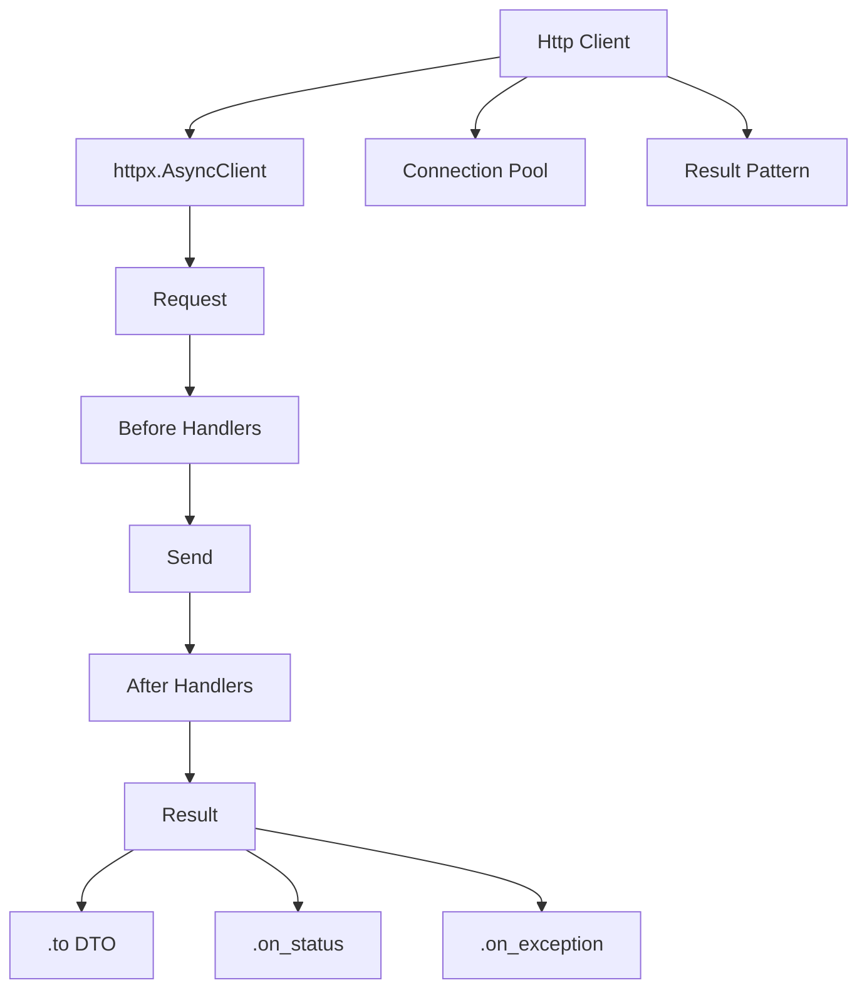

# HTTP Client - Overview

Cliente HTTP asíncrono con connection pooling, retry automático y Result pattern.

## Características

- **Connection Pooling** - Reutiliza conexiones TCP/TLS
- **Async/Await** - Basado en httpx
- **Result Pattern** - Manejo de errores sin excepciones
- **Retry Automático** - Backoff exponencial configurable
- **Handlers** - Hooks before/after para logging, métricas
- **Type-Safe** - Mapeo automático a DTOs (Pydantic, dataclasses)
- **Proxy Rotation** - Round-robin entre múltiples proxies
- **IoC Integrado** - Inyección automática via `@inject`

## Arquitectura



## Componentes

| Componente | Descripción |
|---|---|
| `Http` | Cliente principal. Se inyecta con `@inject` |
| `Result` | Wrapper de respuesta con `to()`, `on_status()`, `on_exception()` |
| `HttpConfig` | Configuración (timeouts, pool, retry, proxies) |

## Ejemplo Rápido

```python
from dataclasses import dataclass
from R5.http import Http
from R5.ioc import inject

@dataclass
class User:
    id: int
    name: str
    email: str

@inject
async def main(http: Http):
    # GET con mapeo a DTO
    user = (await http.get("https://api.example.com/users/1")).to(User)

    # POST con retry
    result = await http.retry(attempts=3, delay=1.0).post(
        "https://api.example.com/users",
        json={"name": "John", "email": "john@example.com"}
    )

    # Handlers encadenados
    (await http.get("https://api.example.com/users/1"))
        .on_status(404, lambda req, res: print("Not found"))
        .on_exception(lambda e: print(f"Error: {e}"))
```

## Lifecycle

El cliente es un `@resource` del IoC container — se crea y cierra automáticamente:

```python
@inject
async def my_service(http: Http):
    result = await http.get("/data")
    # Al cerrar el container, el cliente se cierra automáticamente
```

## Próximos Pasos

- [Basic Usage](basic-usage.md) - GET, POST, PUT, DELETE, DTOs, handlers
- [Advanced Features](advanced.md) - Retry, proxy rotation, circuit breaker
- [Result Pattern](result.md) - Manejo de respuestas y errores
