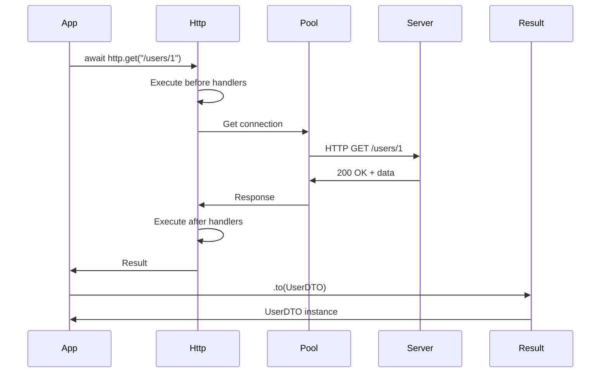

# HTTP Client - Overview

El cliente HTTP de R5 proporciona una interfaz moderna para realizar peticiones HTTP con connection pooling, retry automático y manejo robusto de errores.

## Características

- ✅ **Connection Pooling** - Reutiliza conexiones para mejor rendimiento
- ✅ **Async/Await** - Totalmente asíncrono con httpx
- ✅ **Result Pattern** - Manejo de errores sin excepciones
- ✅ **Retry Automático** - Configuración flexible de reintentos
- ✅ **Handlers** - Hooks para logging, métricas, etc.
- ✅ **Type-Safe** - Mapeo automático a DTOs
- ✅ **Proxy Rotation** - Soporte para múltiples proxies
- ✅ **Inyección IoC** - Integrado con el container

## Arquitectura

```mermaid
graph TB
    A[Http Client] --> B[httpx.AsyncClient]
    A --> C[Connection Pool]
    A --> D[Result Pattern]
    
    B --> E[Request]
    E --> F[Before Handlers]
    F --> G[Send]
    G --> H[After Handlers]
    H --> I[Result]
    
    I --> J[.to(DTO)]
    I --> K[.on_status()]
    I --> L[.on_exception()]
```

## Componentes Principales

### Http Client

El cliente principal que gestiona todas las requests:

```python
from R5.http import Http
from R5.ioc import inject

@inject
async def fetch_data(http: Http):
    result = await http.get("https://api.example.com/users/1")
    return result
```

### Result

Wrapper que encapsula la respuesta HTTP:

```python
result = await http.get("/users/1")

# Acceso a propiedades
print(result.status)       # 200
print(result.response)     # httpx.Response
print(result.exception)    # None si exitosa
```

### HttpConfig

Configuración del cliente HTTP:

```python
from R5.ioc import config
from R5.http.http import HttpConfig

@config(file='.env')
class MyHttpConfig(HttpConfig):
    max_connections: int = 100
    connect_timeout: float = 5.0
    max_retries: int = 3
```

## Flujo de una Request



## Ejemplo Completo

```python
import asyncio
from dataclasses import dataclass
from R5.http import Http
from R5.ioc import inject, config
from R5.http.http import HttpConfig

@config(file='.env')
class AppHttpConfig(HttpConfig):
    max_connections: int = 50
    connect_timeout: float = 10.0
    max_retries: int = 3
    retry_statuses: list[int] = [429, 500, 502, 503]

@dataclass
class User:
    id: int
    name: str
    email: str
    username: str

@inject
async def main(http: Http):
    # Simple GET
    result = await http.get("https://jsonplaceholder.typicode.com/users/1")
    
    # Mapear a DTO
    user = result.to(User)
    
    if user:
        print(f"User: {user.name} ({user.email})")
    
    # Con handlers
    result = await http.get(
        "https://jsonplaceholder.typicode.com/users/999",
        on_status={
            404: lambda: print("User not found"),
            200: lambda: print("User found")
        }
    )
    
    # Con retry
    result = await http.retry(
        attempts=3,
        delay=1.0
    ).get("https://jsonplaceholder.typicode.com/posts/1")
    
    print(f"Status: {result.status}")

if __name__ == "__main__":
    asyncio.run(main())
```

## Connection Pooling

R5 usa `httpx.AsyncClient` internamente con connection pooling:

```python
@inject
async def concurrent_requests(http: Http):
    # Todas estas requests reutilizan conexiones del pool
    results = await asyncio.gather(
        http.get("https://api.example.com/users/1"),
        http.get("https://api.example.com/users/2"),
        http.get("https://api.example.com/users/3"),
        http.get("https://api.example.com/users/4"),
        http.get("https://api.example.com/users/5")
    )
    
    return results
```

**Beneficios:**
- Reutiliza conexiones TCP
- Reduce latencia
- Menor overhead de SSL/TLS
- Mejor rendimiento

## Result Pattern

En lugar de lanzar excepciones, R5 retorna un `Result`:

```python
result = await http.get("/users/1")

# Verificar éxito
if result.status == 200:
    user = result.to(User)

# Verificar error
if result.status == 404:
    print("Not found")

# Verificar excepción
if result.exception:
    print(f"Error: {result.exception}")

# Encadenar handlers
result.on_status(404, lambda req, res: handle_not_found())
      .on_status(200, lambda req, res: handle_success())
      .on_exception(lambda e: log_error(e))
```

**Beneficios:**
- No necesitas try/except
- Flujo más claro
- Fácil composición
- Type-safe

## Métodos HTTP

R5 soporta todos los métodos HTTP estándar:

```python
@inject
async def http_methods(http: Http):
    # GET
    result = await http.get("/users/1")
    
    # POST
    result = await http.post("/users", json={"name": "John"})
    
    # PUT
    result = await http.put("/users/1", json={"name": "Jane"})
    
    # PATCH
    result = await http.patch("/users/1", json={"email": "new@example.com"})
    
    # DELETE
    result = await http.delete("/users/1")
```

## Configuración Básica

### Timeouts

```python
result = await http.get("/users/1", timeout=10.0)
```

### Headers Personalizados

```python
result = await http.get(
    "/users/1",
    headers={
        "Authorization": "Bearer token123",
        "X-Custom-Header": "value"
    }
)
```

### Query Parameters

```python
result = await http.get(
    "/users",
    params={
        "page": 1,
        "limit": 10,
        "sort": "name"
    }
)
# GET /users?page=1&limit=10&sort=name
```

### POST con JSON

```python
result = await http.post(
    "/users",
    json={
        "name": "John Doe",
        "email": "john@example.com"
    }
)
```

### POST con Form Data

```python
result = await http.post(
    "/upload",
    data={
        "field1": "value1",
        "field2": "value2"
    }
)
```

## Handlers (Hooks)

### Before Handler

Se ejecuta antes de cada request:

```python
def log_request(request):
    print(f"→ {request.method} {request.url}")

http.on_before(log_request)

# Ahora todas las requests logean
await http.get("/users/1")  # → GET https://api.example.com/users/1
```

### After Handler

Se ejecuta después de cada request exitosa:

```python
def log_response(request, response):
    print(f"← {response.status_code}")

http.on_after(log_response)

await http.get("/users/1")  # ← 200
```

### Handlers Locales

Para una sola request:

```python
result = await http.get(
    "/users/1",
    on_before=lambda req: print(f"Fetching {req.url}"),
    on_after=lambda req, res: print(f"Got {res.status_code}")
)
```

## Retry Automático

```python
# Retry en status codes específicos
result = await http.retry(
    attempts=3,
    delay=1.0,
    backoff=2.0,
    when_status=(429, 500, 502, 503)
).get("/api/data")

# Retry en excepciones
result = await http.retry(
    attempts=5,
    delay=0.5,
    when_exception=(httpx.TimeoutException, httpx.NetworkError)
).get("/api/data")
```

## Lifecycle Management

El cliente HTTP es un `@resource`, se limpia automáticamente:

```python
@inject
async def my_service(http: Http):
    # Usa http normalmente
    result = await http.get("/data")
    
    # Al salir de la función, el cliente se cierra automáticamente
    # (si no hay más referencias)
```

Manual cleanup:

```python
http = Container.resolve(Http)
# Usar http...
await http.close()
```

## Comparación con Otras Librerías

### R5 vs requests

```python
# requests (sync, blocking)
import requests
response = requests.get("https://api.example.com/users/1")
user = response.json()

# R5 (async, connection pooling)
@inject
async def fetch_user(http: Http):
    result = await http.get("https://api.example.com/users/1")
    user = result.to(UserDTO)
```

### R5 vs httpx directo

```python
# httpx (manual pooling)
async with httpx.AsyncClient() as client:
    response = await client.get("https://api.example.com/users/1")
    user = response.json()

# R5 (pooling automático + IoC)
@inject
async def fetch_user(http: Http):
    result = await http.get("https://api.example.com/users/1")
    user = result.to(UserDTO)
```

### R5 vs aiohttp

```python
# aiohttp
async with aiohttp.ClientSession() as session:
    async with session.get("https://api.example.com/users/1") as response:
        user = await response.json()

# R5
@inject
async def fetch_user(http: Http):
    result = await http.get("https://api.example.com/users/1")
    user = result.to(UserDTO)
```

## Próximos Pasos

- [Basic Usage](basic-usage.md) - Uso básico del cliente HTTP
- [Advanced Features](advanced.md) - Retry, handlers, proxy rotation
- [Result Pattern](result.md) - Manejo de respuestas y errores
- [API Reference](../../api/http.md) - Documentación completa de la API
